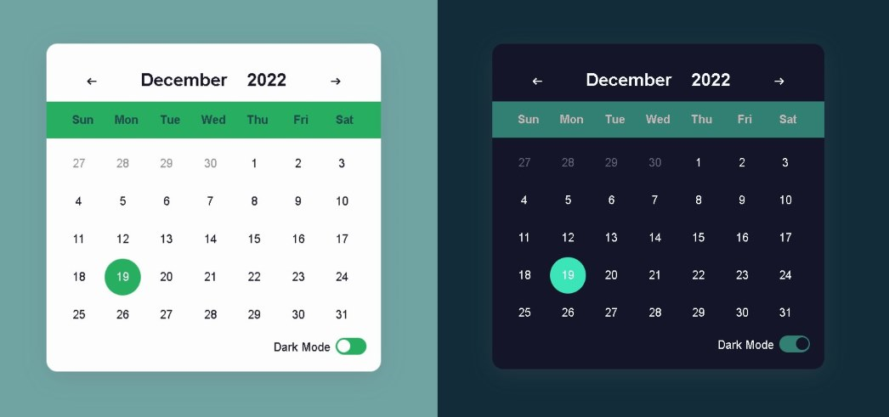

# JS-Project---Calendar

#### By Anand Kumar
This is a webpage based app of live Calendar.

## Table of contents

  - [Description](#description)
  - [Screenshot](#Screenshot)
  - [Tech-Stacks-Used](#Tech-Stacks-Used)
  - [What I learned](#what-i-learned)
  - [Links](#links) 
  - [Useful resources](#useful-resources)
- [Author](#author)

## Overview

### Description

This is web based live App of Calendar, and this is responsive by nature for big and small devices, with the use of frontend technologies.

- It allow user to filter dates and set dates/years.
- Can See hover states for all interactive elements on the page.
- User can select dark mode and light mode.
- The present date in light mode shows in Eucalyptus color and in dark mode light green color.

### Screenshot

## Tech-Stacks-Used
   
- HTML5
- CSS3
- JavaScript

### What I learned

While doing this project I have implemented the Javascript functionality of dropdown menu for month and year and also implemented drak mode functionality, along with I learnt about date object different properties. This Project really helped me to polish my css skills as well as JavaScript skills to render something which was running in my mind for combining present, past and future time. I also learnt to implement HTML,CSS,JavaScript to meet design expectation.

### Links

- Code URL     : [https://github.com/Anand-kumar96/Calendar](https://github.com/Anand-kumar96/Calendar)
- Live Site URL: [https://html-css-javascript-calendar.netlify.app](https://html-css-javascript-calendar.netlify.app)

### Useful resources

- [https://www.w3schools.com/](https://www.w3schools.com/) - This helped me for strengthening the fundamentals of HTML and CSS. it provides all the concept from scratch level.
- [https://stackoverflow.com/](https://stackoverflow.com/) - This is an amazing website for solving your doubts and finding any different approaches. I always refer to it to learn different properties of css and javascript.

## Author
#### Anand Kumar
- Linkedin - [Anand-kumar96](https://www.linkedin.com/in/anand-kumar96/)
- GitHub -   [Anand-kumar96](https://github.com/Anand-kumar96)
